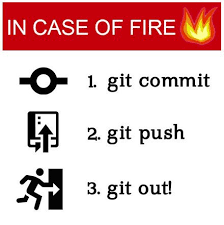

### Crash/survival notes on git

[reference material](https://git-scm.com/book/en/v2)

### Why use git?

 

### What is git?

Git is a free and open source distributed version control system designed to handle everything from small to very large projects with speed and efficiency.

### What is github?

GitHub is an Internet hosting service for software development and version control using Git.

 

### Let's start!

make sure that you have `git` installed.

initialize it (or it will complain the first time you do anything):

`git config --global user.name "Whatever Name"`
`git config --global user.email whatever@whatever`

### Passwordless access

Let's follow [instructions on github](https://docs.github.com/en/authentication/connecting-to-github-with-ssh/checking-for-existing-ssh-keys).

### Now let's make a nice bash prompt

https://github.com/magicmonty/bash-git-prompt


go to https://github.com/sissa/AdvancedProgramming_dssc22 and press "fork"

clone the main, sissa repo:

`git clone ADDRESS_FROM_GITHUB` (choose ssh if you did the password step)

go into the folder  (`cd AdvancedProgramming_dssc22`)

`git remote -v` to see the current remote. Whatever you cloned from, will become "origin".

`git remote add THINK_OF_A_SHORT_NAME ADDRESS_FROM_GITHUB_OF_YOUR_FORK`

`git remote -v` should now show more things

`git pull origin main` <--- this is what you should do after every lecture

Do the following to "play around":

create any text file inside your folder 

`git status` <---- you should see the file you created listed

`git add YOUR_FILE`

`git commit -m "USEFUL MESSAGE"`


`git push SHORT_NAME_YOU_CHOSE_FOR_YOUR_FORK_REMOTE main`

I recommend pushing your homework to your forks to keep track of it. However, note that the SISSA repository we are using is public and thus everything, including your fork, is open to the internet. If you want to "hide", make a separate private repository.


### Make your own repository 


Just go to github and follow visual instructions (choose "with README"), then 

`git clone YOUR_REPOSITORY`

add some text file to it

`git push origin main` (bad practice - only for "trash repositories" and learning purposes)

### Create a branch

`git checkout -b development`

edit your text file, add and commit

`git push origin development`

go to github and you will see a "create a pull request" (that's how things should get to `main` in real repositories)

`git checkout main`

`git pull origin main` (to update main after github pull request has been merged)

### Merging manually

`git checkout development`

`git checkpout -b new_branch`

edit the file again, add, commit, push to new_branch, switch back to development

`git merge new_branch`

check your text file

### Let's create conflict

edit the file in development, add, commit, push

edit the file in new_branch, add, commit, push

now try, while being in new_branch,

`git pull origin development`

What happens?


### Gitignore

[A collection of templates](https://github.com/github/gitignore)

If you are sure that your `.gitignore` is good, you can just do 

```
git add -A
```

instead of adding files manually. Sooner of later you will push some trash like this, so only do it on your own repositories or if there are way too many files to add.

**Git has many more options, but it's better if you learn them when you need them.** 


### Fun picture




